# 19丨决策树（下）：泰坦尼克乘客生存预测

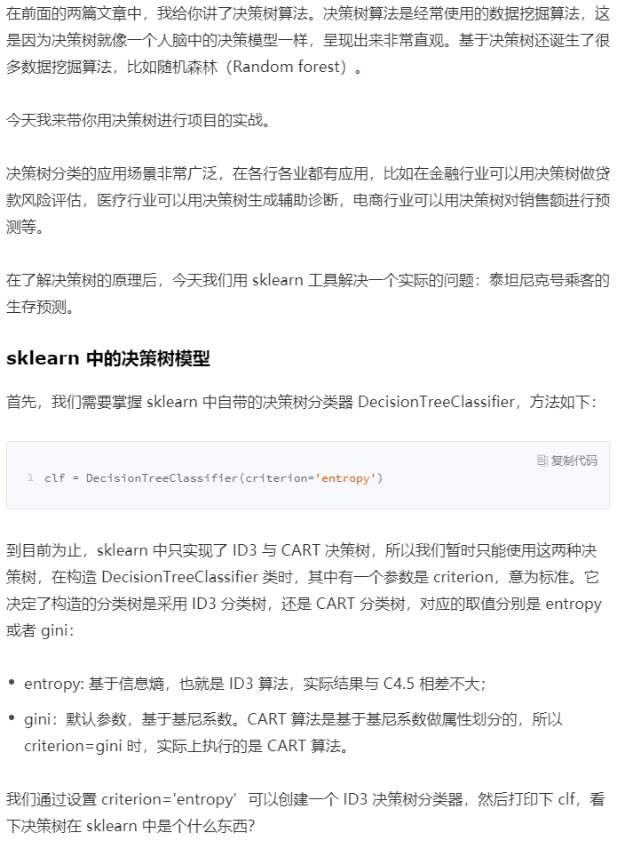

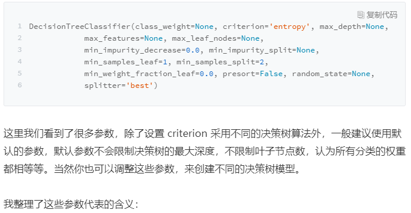


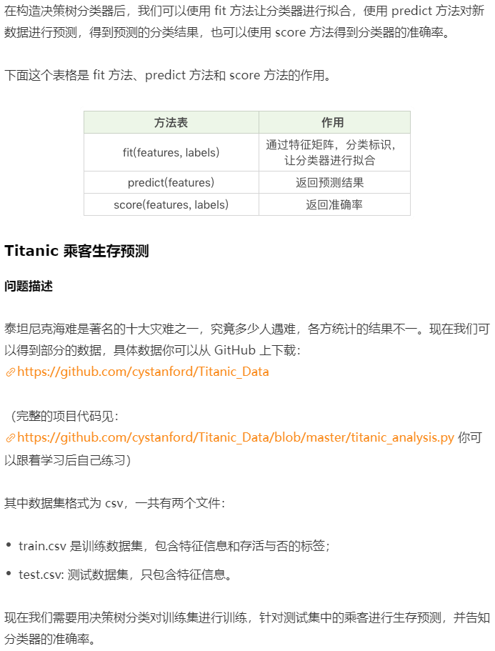

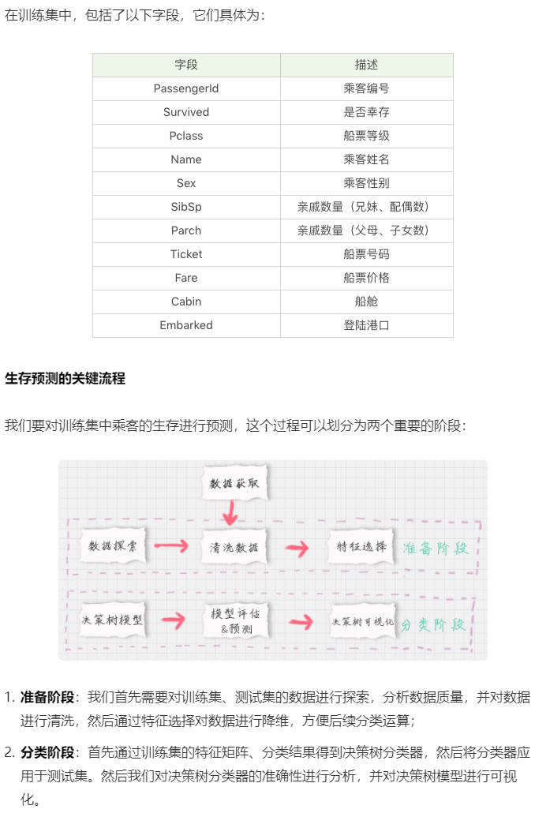

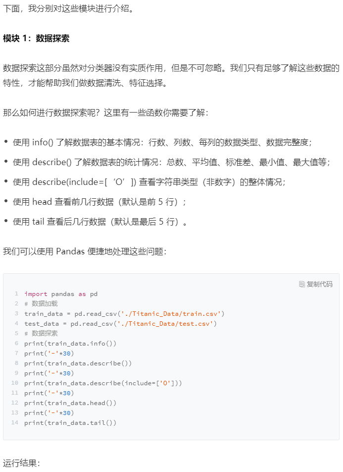

```python

<class 'pandas.core.frame.DataFrame'>
RangeIndex: 891 entries, 0 to 890
Data columns (total 12 columns):
PassengerId    891 non-null int64
Survived       891 non-null int64
Pclass         891 non-null int64
Name           891 non-null object
Sex            891 non-null object
Age            714 non-null float64
SibSp          891 non-null int64
Parch          891 non-null int64
Ticket         891 non-null object
Fare           891 non-null float64
Cabin          204 non-null object
Embarked       889 non-null object
dtypes: float64(2), int64(5), object(5)
memory usage: 83.6+ KB
None
------------------------------
       PassengerId    Survived     ...           Parch        Fare
count   891.000000  891.000000     ...      891.000000  891.000000
mean    446.000000    0.383838     ...        0.381594   32.204208
std     257.353842    0.486592     ...        0.806057   49.693429
min       1.000000    0.000000     ...        0.000000    0.000000
25%     223.500000    0.000000     ...        0.000000    7.910400
50%     446.000000    0.000000     ...        0.000000   14.454200
75%     668.500000    1.000000     ...        0.000000   31.000000
max     891.000000    1.000000     ...        6.000000  512.329200

[8 rows x 7 columns]
------------------------------
                                          Name   Sex   ...       Cabin Embarked
count                                      891   891   ...         204      889
unique                                     891     2   ...         147        3
top     Peter, Mrs. Catherine (Catherine Rizk)  male   ...     B96 B98        S
freq                                         1   577   ...           4      644

[4 rows x 5 columns]
------------------------------
   PassengerId  Survived  Pclass    ...        Fare Cabin  Embarked
0            1         0       3    ...      7.2500   NaN         S
1            2         1       1    ...     71.2833   C85         C
2            3         1       3    ...      7.9250   NaN         S
3            4         1       1    ...     53.1000  C123         S
4            5         0       3    ...      8.0500   NaN         S

[5 rows x 12 columns]
------------------------------
     PassengerId  Survived  Pclass    ...      Fare Cabin  Embarked
886          887         0       2    ...     13.00   NaN         S
887          888         1       1    ...     30.00   B42         S
888          889         0       3    ...     23.45   NaN         S
889          890         1       1    ...     30.00  C148         C
890          891         0       3    ...      7.75   NaN         Q

[5 rows x 12 columns]
```

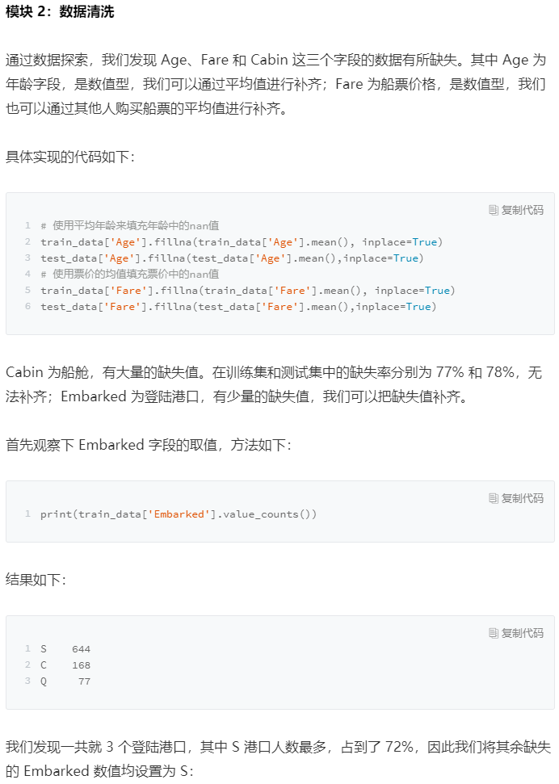

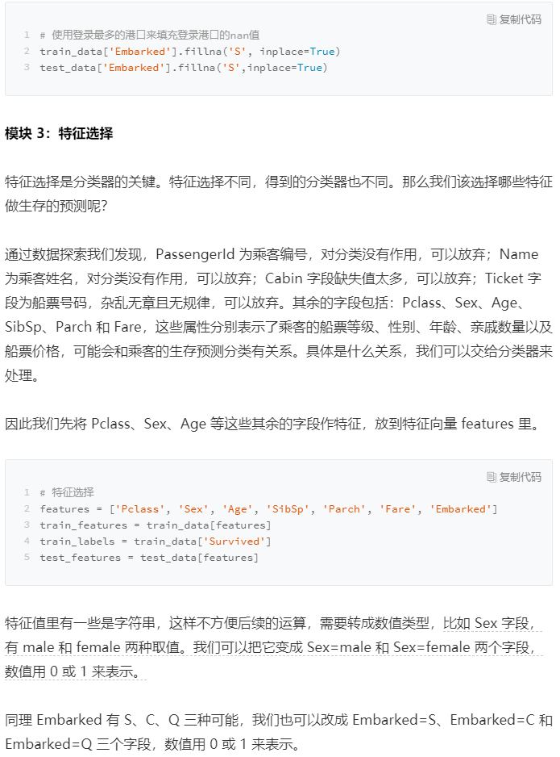

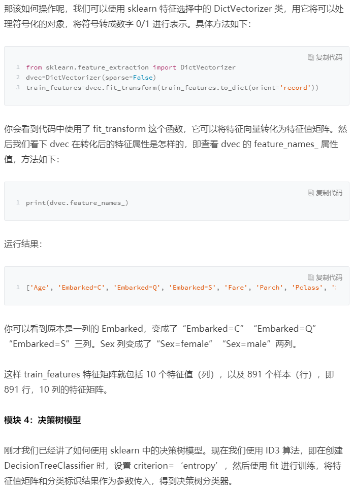

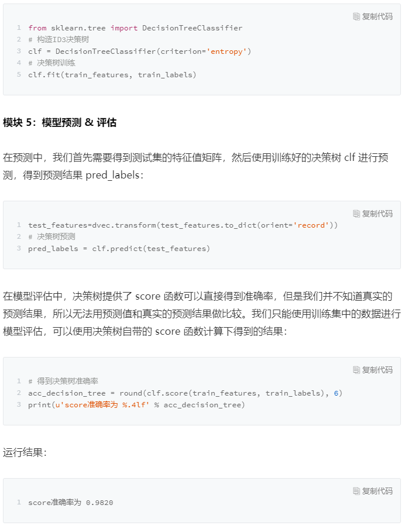

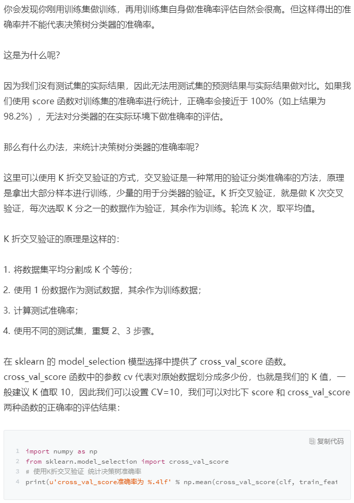

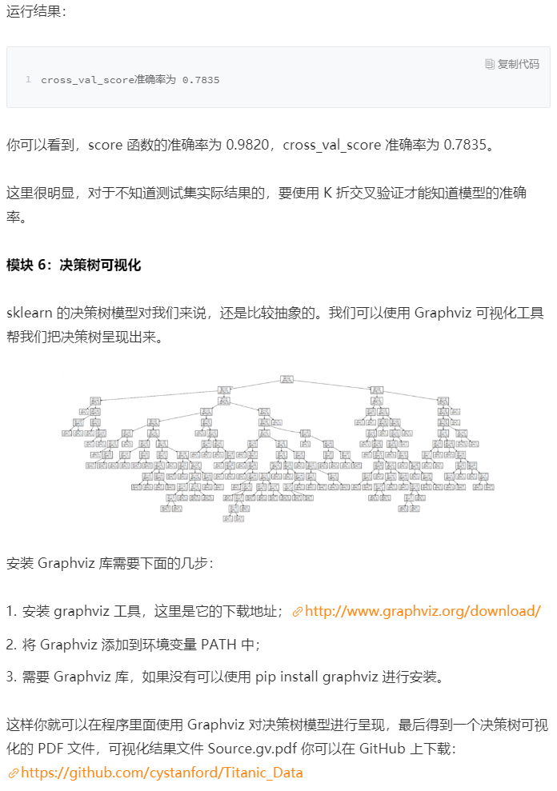

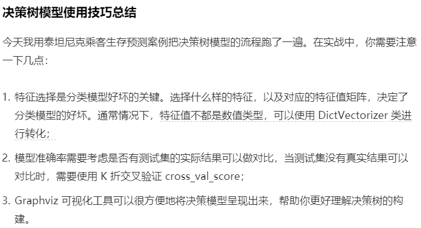

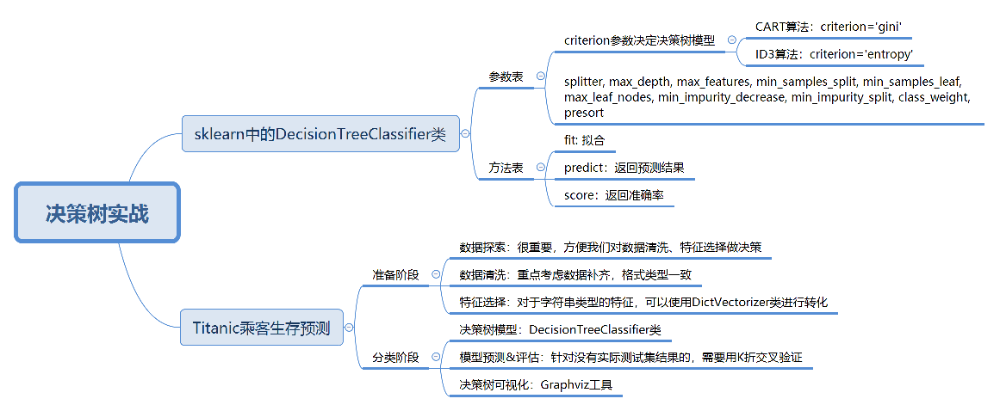

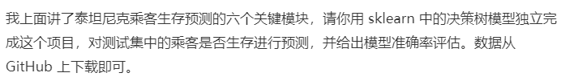

